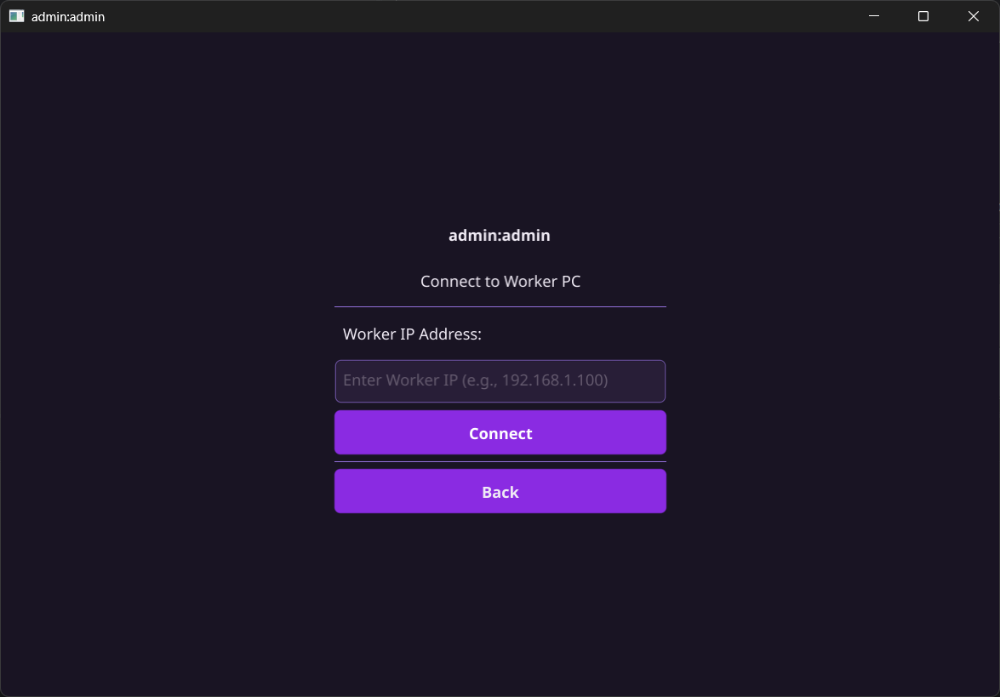
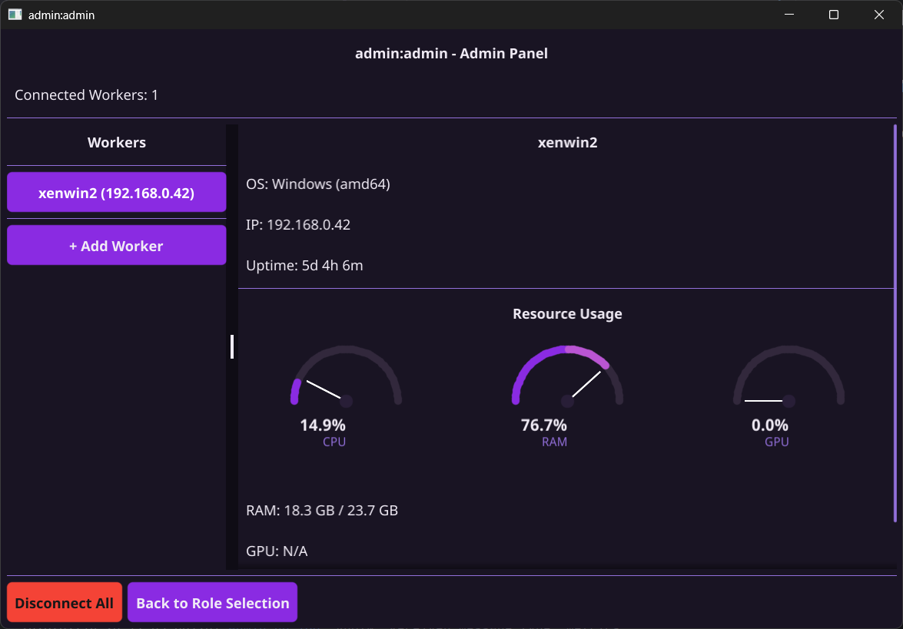
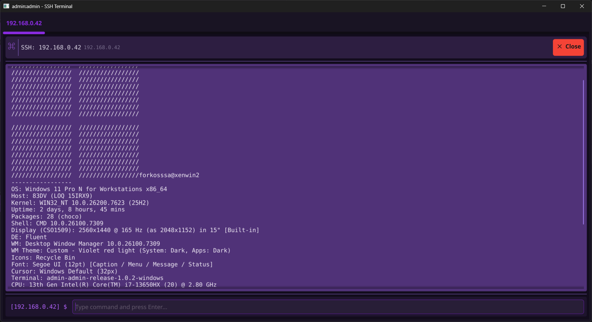

# admin:admin - Demo & Functionality Guide
## Release 1.0.2 | Windows & Linux

---

## Overview

**admin:admin** is a lightweight remote system monitoring tool that allows an Admin PC to monitor and manage multiple Worker PCs over a local network.

---

## Main Menu

When you launch the application, you'll see the role selection screen:

Choose your role:
- **Admin PC** - Monitor and manage remote workers
- **Worker PC** - Be monitored by an admin

---

## Worker Mode

### Waiting for Connection

After selecting "Worker PC", you'll see the waiting screen with your connection details:

This screen shows:
- Your local IP address (share this with the Admin)
- The port number (9876)
- SSH credentials (customizable)

### Connected to Admin

Once an Admin connects, the window becomes compact:

---

## Admin Mode

### Connection Screen

After selecting "Admin PC", enter the Worker's IP address to connect:

### Monitoring Dashboard

Once connected, you'll see real-time system metrics:

The dashboard displays:
- **CPU Usage** - Real-time CPU utilization (gauge)
- **RAM Usage** - Memory usage with total/used (gauge)
- **GPU Usage** - Graphics card utilization (gauge)
- **System Info** - OS, hostname, IP address
- **Uptime** - Time since last boot
- **Worker List** - All connected workers (multi-worker support)

---

## SSH Terminal

Click "Open SSH Terminal" to access the remote command line:

Features:
- Multi-tab support (multiple sessions)
- Command history
- Built-in commands: `help`, `clear`, `exit`
- Purple-themed terminal UI

Default credentials:
- **Username:** `admin`
- **Password:** `admin`

---

## Quick Start

### On Worker PC:
1. Run `admin-admin.exe`
2. Click "Worker PC"
3. Note the displayed IP address

### On Admin PC:
1. Run `admin-admin.exe`
2. Click "Admin PC"
3. Enter Worker's IP address
4. Click "Connect"

---

## Network Requirements

| Port | Protocol | Purpose |
|------|----------|---------|
| 9876 | TCP | Main communication |
| 2222 | TCP | SSH remote access |

Ensure these ports are open in your firewall.

---

## Downloads

- **Windows:** Available on [GitHub Releases](https://github.com/Fork0n/admin-admin/releases)
- **Linux:** Available on [GitHub Releases](https://github.com/Fork0n/admin-admin/releases)

---

*admin:admin v1.0.2 - February 2026*
