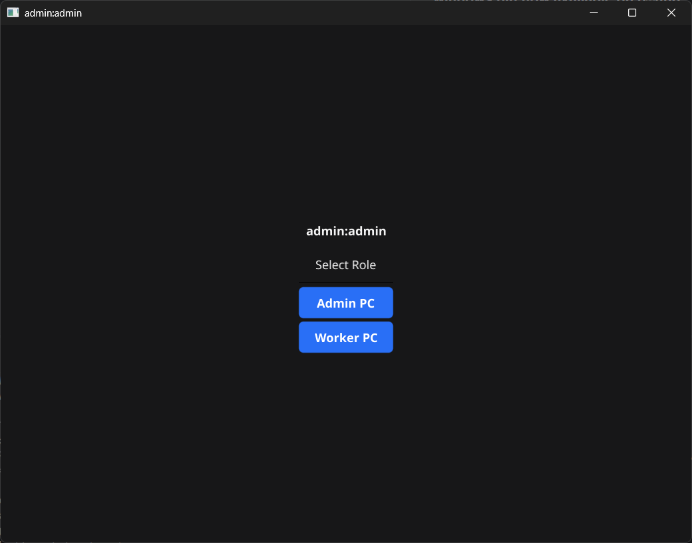
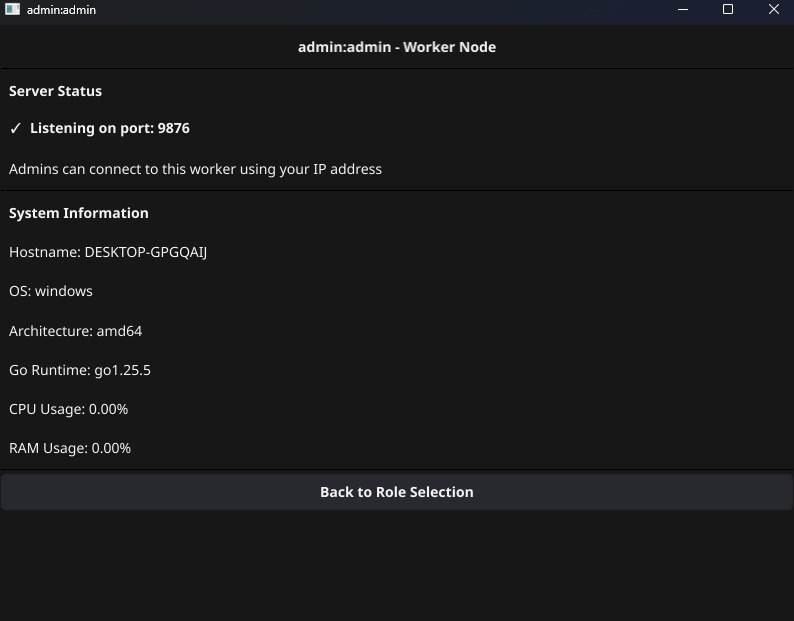

# breif functionality and UI demo 
## (relevant to the development build 0.5)
### windows bin now available on github

main menu - role selection

admin menu - shows status and worker info

worker menu - shows status 

admin menu with a connected worker

worker menu connected to an admin